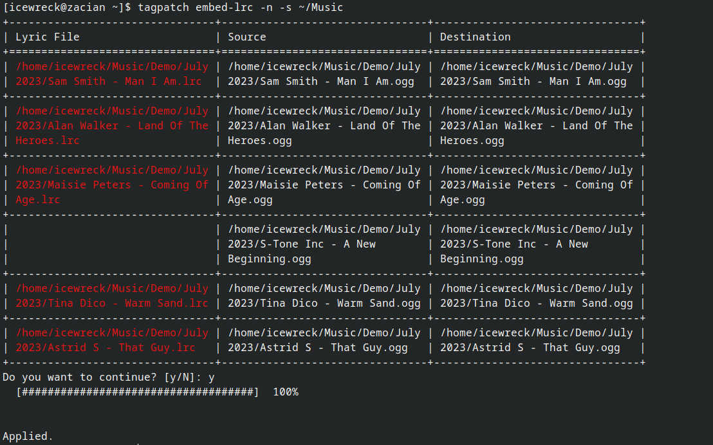

# tagpatch

CLI tool which automatically applies common/repetitive patches to music tags.
You should use a GUI tool like [KDE's Kid3](https://kid3.kde.org/) for complicated patches.

## Install

**From GitHub**

```shell
sudo wget https://github.com/IceWreck/tagpatch/releases/download/v0.1.2/tagpatch-v0.1.2 \
  -O /usr/local/bin/tagpatch && sudo chmod +x /usr/local/bin/tagpatch
```


**Using pip**

```
pip install tagpatch
```

It's recommended to install this with `--user` or inside a venv.

## Example

```shell
tagpatch embed-lrc -n -s ~/Music
```
The changes will be highlighted in red. Confirm to continue.




## Usage

```
[icewreck@zacian ~]$ tagpatch
Usage: tagpatch [OPTIONS] COMMAND [ARGS]...

Options:
--help  Show this message and exit.

Commands:
artist-name  A patch which replaces existing delimiters in the `Artist`...
embed-lrc    A patch which embeds .lrc files of the same name into the...
```

```
[icewreck@zacian ~]$ tagpatch embed-lrc --help
Usage: tagpatch embed-lrc [OPTIONS]

A patch which embeds .lrc files of the same name into the track file.

Options:
-s, --src PATH    [default: /home/icewreck]
-d, --dst PATH
-y, --assume-yes
-n, --nested
--help            Show this message and exit.
```

```
[icewreck@zacian ~]$ tagpatch artist-name --help
Usage: tagpatch artist-name [OPTIONS]

A patch which replaces existing delimiters in the `Artist` tag with the `/`
seperator.

Options:
-s, --src PATH    [default: /home/icewreck]
-d, --dst PATH
-y, --assume-yes
-n, --nested
--help            Show this message and exit.
```
